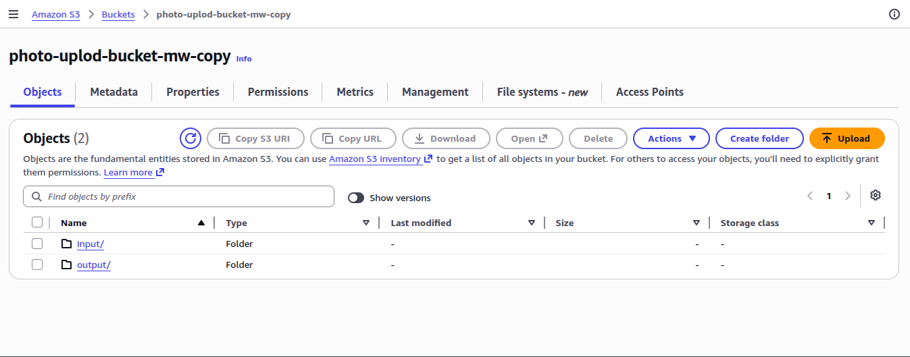
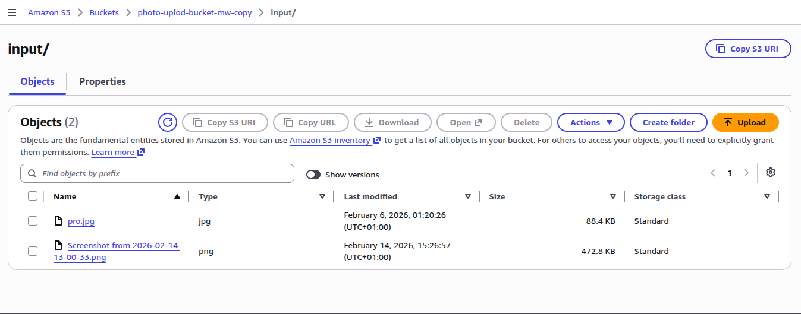
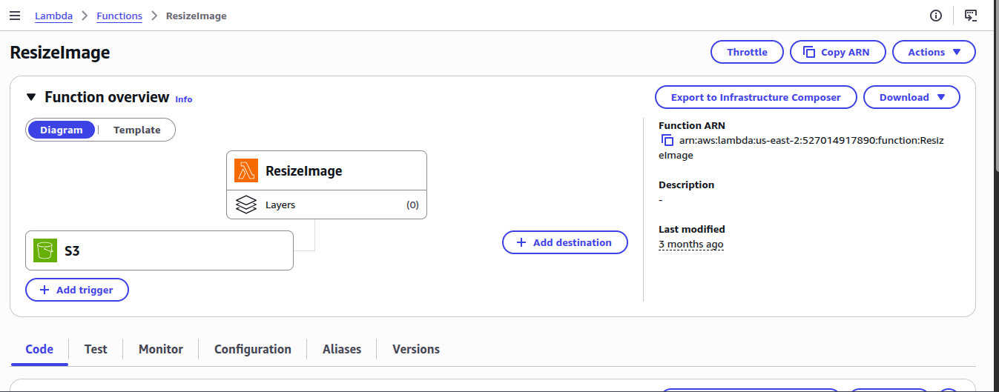

# AWS Serverless Image Resizer

An automated, event-driven image processing pipeline built with **AWS Lambda** and **Amazon S3**. This project demonstrates a serverless architecture where images uploaded to an S3 bucket are automatically resized into thumbnails.

## 🚀 Architecture Overview
1. **Trigger:** An image is uploaded to the `input/` folder of the S3 bucket.
2. **Compute:** AWS Lambda is triggered, downloads the image, and uses the **Pillow** library to resize it.
3. **Storage:** The processed thumbnail is saved into the `output/` folder of the same bucket.

## 📸 Project Documentation

### 1. S3 Bucket Configuration
The bucket is organized with two primary prefixes (folders) to manage the workflow and prevent recursive loops.


### 2. Input and Output Folders
- **Input:** Where the high-resolution source images are stored.

- **Output:** Where the 300x300 thumbnails are deposited by the Lambda function.


### 3. Serverless Logic (AWS Lambda)
The core logic is written in Python. It uses an S3 trigger to capture the bucket name and object key dynamically from the event metadata.


## 🛠️ Local Development & Setup
To run or modify the resizing logic locally:
1. Clone the repository.
2. Install dependencies:
   ```bash
   pip install -r requirements.txt